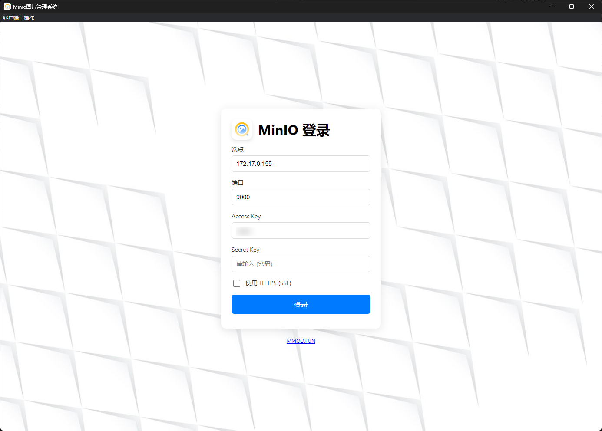
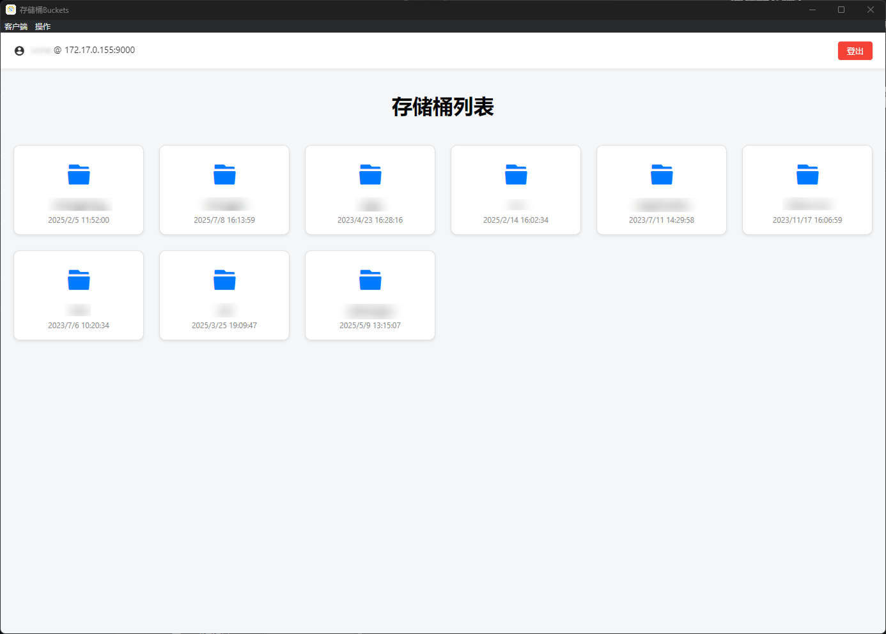
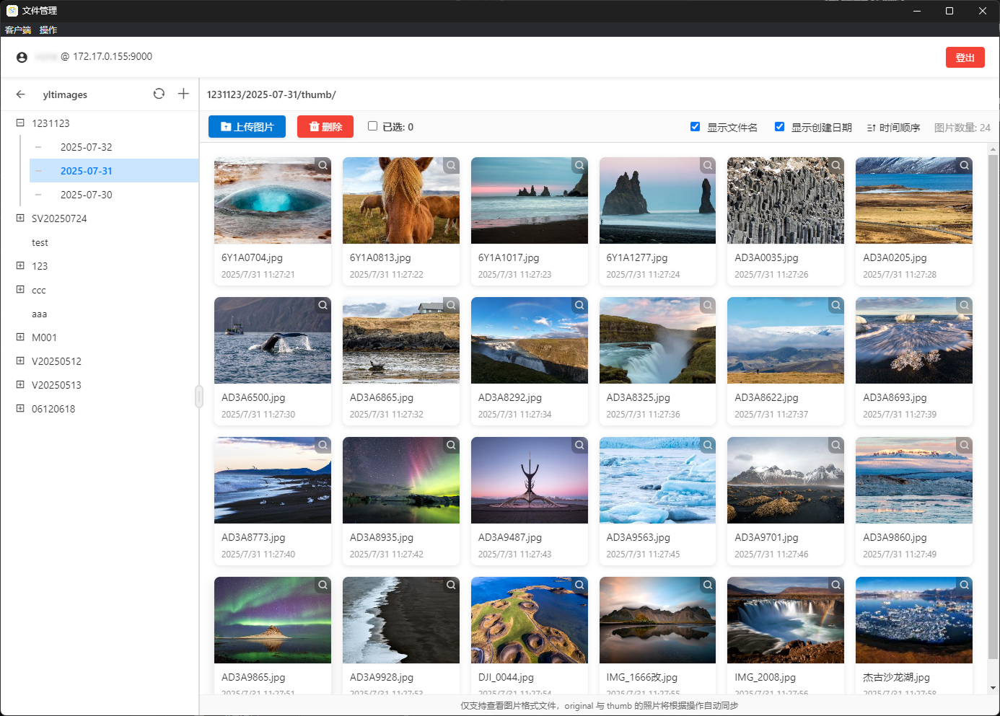
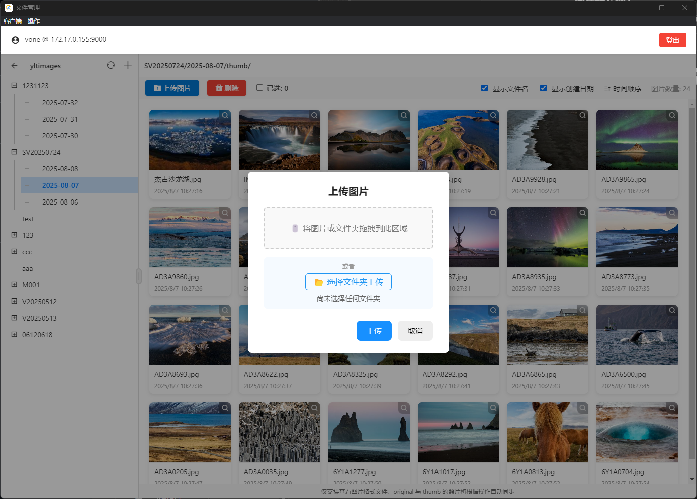
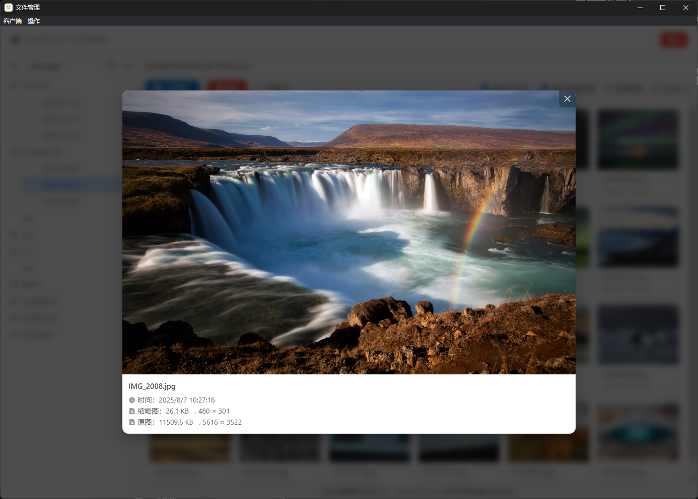
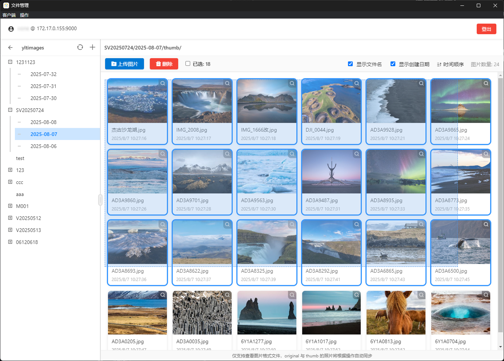

# Minio-PhotoManagement 照片管理

一个基于 Electron 的 MinIO 图片管理系统客户端，使用 MinIO JavaScript SDK (兼容 AWS S3 API) 实现。

## 功能介绍

- **MinIO 服务器登录**  
  支持填写 MinIO 服务器登录信息，登录时会自动保存登录配置（密码不保存，确保安全）。
  

- **桶（Buckets）查询**  
  支持查看已有桶列表（不支持创建桶，请提前在 MinIO 服务端创建）。
  

- **目录树结构浏览**  
  支持查看桶内路径的目录树结构，清晰展示文件和文件夹层级。
  

- **批量上传与管理**

  - 支持批量上传图片，自动生成缩略图，原图与缩略图同步上传。
  - 支持浏览图片，显示照片的大小和尺寸等详细信息。
  - 支持多选、批量删除操作，同步删除原图和对应的缩略图。
    
    
    

- **跨平台桌面应用**  
  支持 Windows 和 macOS 平台打包发布。  
  **温馨提示**：Windows 程序请在 Windows 电脑打包，macOS 程序请在 macOS 设备打包，以保证兼容性。

### 照片存储目录结构示例

假设存储桶下有多个一级路径（例如路径 A 和路径 B），目录结构如下：

```
桶
├─ 路径A
│   ├─ .keep          （自动生成的空文件，保持目录有效）
│   ├─ thumb         （缩略图目录，存放生成的缩略图）
│   └─ original      （原图目录，存放上传的原始图片）
├─ 路径B
│   ├─ .keep
│   ├─ 二级路径1
│   │   ├─ .keep
│   │   ├─ thumb
│   │   └─ original
│   └─ 二级路径2
│       ├─ .keep
│       └─ 三级路径
│           ├─ .keep
│           ├─ thumb
│           └─ original
```

- `.keep` 文件用于保持空目录结构的存在，防止目录被 MinIO 忽略。
- `thumb` 目录存放对应路径下生成的缩略图。
- `original` 目录存放对应路径下的原始图片文件。
- 照片上传后，会分别以相同的照片文件名存储于当前选中路径的`thumb` `original` 中。

## 技术栈

- Electron
- MinIO JavaScript Client SDK
- Sharp（图片处理）
- Browser-image-compression（浏览器端图片压缩）

## 快速开始

### 安装依赖

```bash
npm install
```

### 启动开发环境

```bash
npm start
```

### 打包发布

```bash
npm run dist
```

打包结果默认输出到 `dist/` 目录。

## 项目结构

- `main.js` - Electron 主进程入口
- `minioClient.js` - MinIO 客户端封装
- `pages/` - 前端页面文件
- `assets/` - 资源文件和图标

## 许可协议

本项目使用 MIT 许可证，详见 LICENSE 文件。
