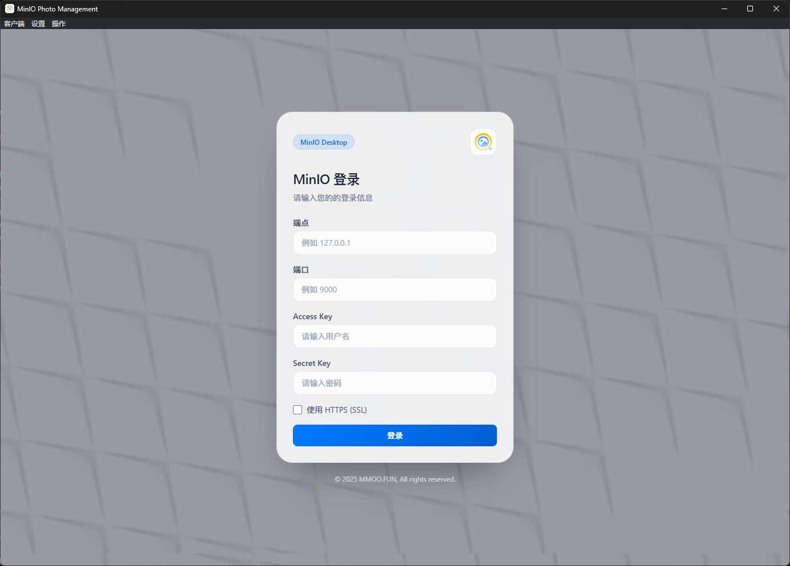
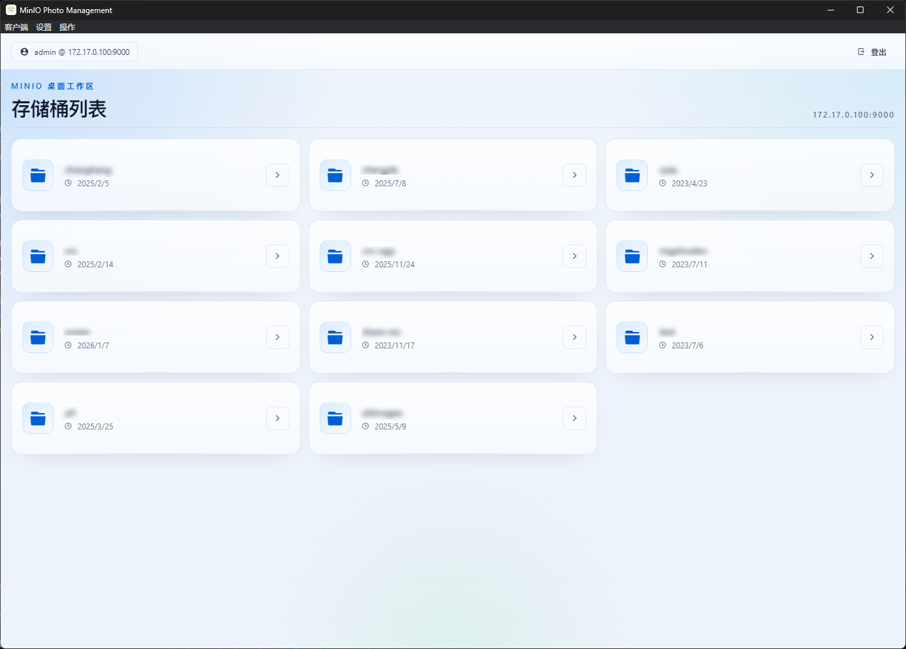
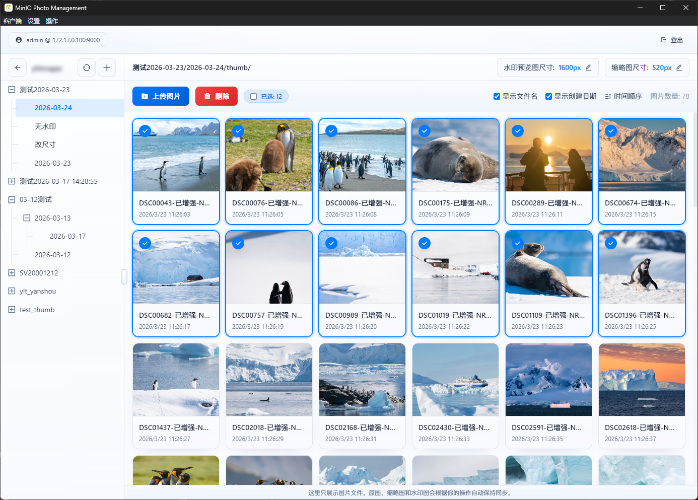
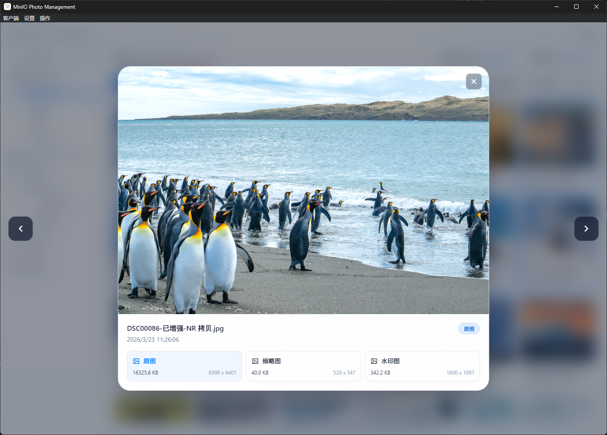
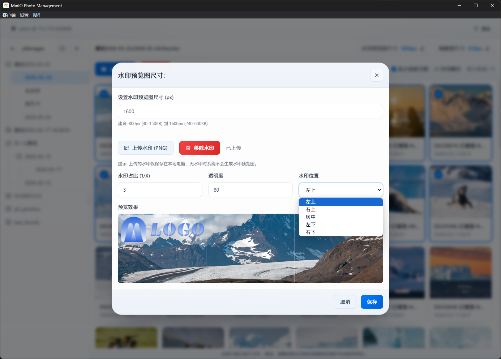

# Minio Photo Management

基于 Electron + Vue 3 + Vite + Tailwind CSS 的 MinIO 图片管理客户端，用于桌面端登录 MinIO、浏览 Bucket、管理目录、批量上传图片，并自动生成缩略图与水印图。

## 功能概览

- MinIO 登录
  - 支持填写 `endPoint`、`port`、`accessKey`、`secretKey`、`useSSL`
  - 登录配置保存在本机 `userData/config.json`
- Bucket 浏览
  - 查看当前 MinIO 下已有 Bucket
  - 进入指定 Bucket 后继续进行目录和图片管理
- 目录树管理
  - 基于 `.keep` 文件维持空目录
  - 支持新建目录、删除目录、展开收起、右键操作
  - 自动过滤 `thumb/`、`original/`、`watermark/` 这类业务内部目录
- 图片上传
  - 支持拖拽文件夹上传
  - 支持选择文件夹上传
  - 上传原图时自动生成缩略图
  - 已配置本地水印图时，自动生成水印图
- 图片管理
  - 支持网格浏览、时间排序、显示文件名、显示日期
  - 支持多选、全选、框选、批量删除
  - 删除时同步清理 `thumb`、`original`、`watermark`
- 图片预览
  - 支持查看原图、缩略图、水印图
  - 支持上一张 / 下一张切换
  - 支持显示时间、尺寸、文件大小等信息
- 水印设置
  - 支持设置水印预览图尺寸
  - 支持设置水印宽度占比、透明度、位置
  - 支持上传 / 删除本地水印图
- 桌面端体验
  - 支持浅色 / 深色主题
  - 支持 Electron 菜单切换语言与主题
  - 支持 Windows 安装包和压缩包输出

## 技术栈

- Electron
- Vue 3
- Vite
- Pinia
- Vue Router
- Tailwind CSS
- MinIO JavaScript SDK
- Sharp

## 目录结构

```text
new1/
├─ electron/              # Electron 主进程、preload、IPC
├─ src/                   # Vue 前端源码
├─ app/                   # Vite 构建输出目录
├─ assets/                # 图标、示例图、静态资源
├─ scripts/               # 开发和打包辅助脚本
├─ package.json
├─ vite.config.js
└─ tailwind.config.js
```

## 图片存储结构

每个业务目录下会按下面的结构组织图片：

```text
bucket/
├─ some-folder/
│  ├─ .keep
│  ├─ original/
│  │  └─ example.png
│  ├─ thumb/
│  │  └─ example.png
│  └─ watermark/
│     └─ example.png
└─ another-folder/
   ├─ .keep
   ├─ original/
   ├─ thumb/
   └─ watermark/
```

说明：

- `.keep` 用于保留空目录
- `original/` 存放原图
- `thumb/` 存放缩略图
- `watermark/` 存放水印图

如果未配置本地水印图，则只会上传原图和缩略图。

## 本地开发

安装依赖：

```bash
npm install
```

启动开发环境：

```bash
npm run start
```

说明：

- `npm run start` 会同时启动 Vite 和 Electron
- 当前真正的 Electron 主入口是 `electron/main.js`
- 当前真正的前端入口是 `src/main.js`

## 构建与发布

仅构建前端资源：

```bash
npm run build
```

构建并直接预览 Electron：

```bash
npm run preview
```

生成最终安装包 / 压缩包：

```bash
npm run dist
```

打包输出目录：

```text
dist/
```

常见产物：

- `MinioPhotoManager Setup <version>.exe`
- `MinioPhotoManager-<version>-win.zip`

## 配置说明

### 登录配置

程序会在本机保存 MinIO 登录配置，结构如下：

```json
{
  "endPoint": "127.0.0.1",
  "port": 9000,
  "accessKey": "minioadmin",
  "secretKey": "minioadmin",
  "useSSL": false
}
```

### 本地设置

界面设置会保存在本地，例如：

- 语言
- 主题
- 缩略图尺寸
- 水印预览图尺寸
- 水印透明度
- 水印位置
- 本地水印图片
- 侧边栏宽度

## 界面截图

### 登录页



### Bucket 列表页



### 文件管理页



### 图片预览页



### 水印设置页



## 注意事项

- Windows 安装包建议在 Windows 环境下构建
- macOS 安装包建议在 macOS 环境下构建
- 本地水印图只保存在当前电脑，不会上传到 MinIO
- 发布前建议至少执行一次 `npm run build` 或 `npm run dist`

## License

MIT
